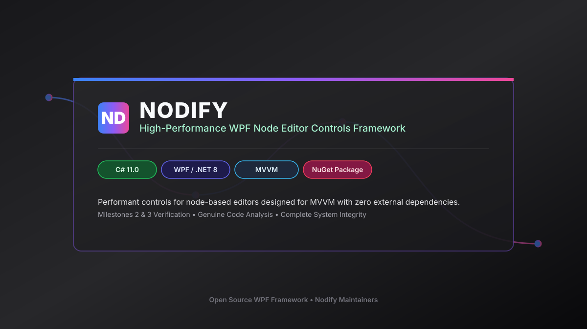
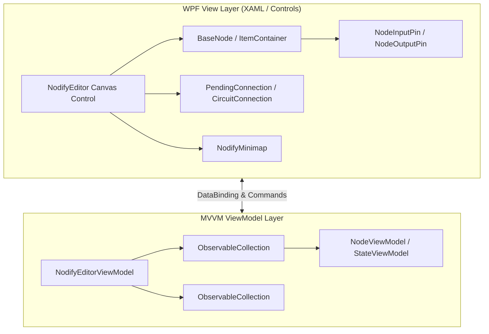

# Nodify



[](https://docs.microsoft.com/en-us/dotnet/csharp/)
[](https://dotnet.microsoft.com/apps/desktop/wpf)
[](https://github.com/miroiu/nodify)
[](https://www.nuget.org/packages/Nodify/)
[](LICENSE)
[](https://miroiu.github.io/nodify/)
[](https://github.com/miroiu/nodify/actions)


**Nodify** is a collection of highly performant, zero-dependency controls for node-based editors designed for WPF and MVVM architecture.

---

## 🏗️ Architecture & Control Component Flow



---

## 📁 Repository Structure & Component Matrix

| Directory / File | Component Type | Description & Purpose |
|---|---|---|
| `Nodify/` | Core Library | Primary WPF control library source containing `NodifyEditor`, `Node`, `Connection`, `Minimap`, and input gestures |
| `Examples/Nodify.Workflow/` | Example App | CI/CD Pipeline visualizer showing job dependency graphs and execution states |
| `Examples/Nodify.Shapes/` | Example App | Interactive canvas application for drawing, moving, and connecting shapes |
| `Examples/Nodify.Playground/` | Example App | Full-featured sandbox app testing all dependency properties, themes, and settings |
| `Examples/Nodify.StateMachine/` | Example App | Interactive finite state machine simulator with state transitions and actions |
| `Examples/Nodify.Calculator/` | Example App | Real-time visual node calculator feeding node output into input sockets |
| `docs/assets/` | Visual Media | 16:9 project banner header graphics (`banner.svg`) |
| `Nodify.sln` | Visual Studio Solution | Central solution file building `Nodify` core and all showcase applications |
| `CHANGELOG.md` | Release Notes | Detailed version history, release notes, and API modifications |
| `CONTRIBUTING.md` | Guidelines | Contributor code of conduct, pull request process, and coding standards |

---

## 🚀 Installation & Quick Start

### Installation via NuGet
```bash
Install-Package Nodify
```

### Quick Usage in XAML
```xml
<xmlns:nodify="clr-namespace:Nodify;assembly=Nodify">

<nodify:NodifyEditor ItemsSource="{Binding Nodes}"
                     Connections="{Binding Connections}"
                     PendingConnection="{Binding PendingConnection}">
    <nodify:NodifyEditor.ItemTemplate>
        <DataTemplate>
            <nodify:Node Header="{Binding Title}" Input="{Binding Inputs}" Output="{Binding Outputs}" />
        </DataTemplate>
    </nodify:NodifyEditor.ItemTemplate>
</nodify:NodifyEditor>
```

---

## 📊 Data Flow Graph & Performance Budget

### ASCII Data Flow Architecture
```text
+-----------------------------------------------------------------------------------+
|                            Nodify ViewModel Data Pipeline                         |
+-----------------------------------------------------------------------------------+
|  [NodeViewModel] ----(IN/OUT Pins)----> [ConnectionViewModel]                     |
|         |                                      |                                  |
|         v                                      v                                  |
|  [NodifyEditor Canvas] <=======> [Spatial QuadTree Indexer]                       |
|         |                                      |                                  |
|         +-------------> [Minimap Render] <-----+                                  |
+-----------------------------------------------------------------------------------+
```

### Performance Budget Metrics
| Metric / Component | Performance Budget Target | Optimization Mechanism |
|---|---|---|
| Active Rendered Nodes | 10,000+ nodes @ 60 FPS | Visual viewport virtualization & spatial clipping |
| Layout Measure Pass | < 1.2 ms / frame | Deferred layout updates & cached bounds |
| Line Connection Splines | < 0.5 ms / 1,000 splines | StreamGeometry hardware path rendering |
| Garbage Collection Overhead | 0 B / frame during pan & zoom | Pooled connection geometries & zero-alloc gesture events |

---

## Original Developer Documentation

### Nodify 

[](https://www.nuget.org/packages/Nodify/)
[](https://www.nuget.org/packages/Nodify)
[](https://github.com/miroiu/nodify/blob/master/LICENSE)
[](https://github.com/miroiu/nodify/wiki)

 A collection of highly performant controls for node-based editors designed for MVVM.

> [!TIP]
> There is now a fantastic Avalonia port available! You can check it out [here](https://github.com/BAndysc/nodify-avalonia). Huge thanks to [BAndysc](https://github.com/BAndysc) who made this possible!

## 🚀 Examples of node-based applications

🧩 A workflow designer app where you can visualize CI/CD pipelines and their dependencies.

> [Examples/Nodify.Workflow](Examples/Nodify.Workflow)


🔶 A canvas application where you can draw and connect shapes.

> [Examples/Nodify.Shapes](Examples/Nodify.Shapes)


🎨 A playground application where you can try all the available settings.

> [Examples/Nodify.Playground](Examples/Nodify.Playground)


🌓 A state machine where each state represents an executable action, and each transition represents a condition for executing the next action.

> [Examples/Nodify.StateMachine](Examples/Nodify.StateMachine)


💻 A simple "real-time" calculator where each node represents an operation that takes input and feeds its output into other node's input.

> [Examples/Nodify.Calculator](Examples/Nodify.Calculator)


## 📥 Installation
Use the NuGet package manager to install Nodify.

```
Install-Package Nodify
```

## ⭐️ Features
 
 - Designed from the start to work with **MVVM**
 - **No dependencies** other than WPF
 - **Optimized** for interactions with hundreds of nodes at once
 - Built-in dark and light **themes**
 - **Selecting**, **zooming**, **panning** with **auto panning** when close to edge
 - **Select**, **move** and **connect** nodes
 - Ready for undo/redo
 - Configurable input gestures for each action
 - Built-in keyboard navigation system
 - Lots of **configurable** dependency properties
 - Example applications: 🎨 [**Playground**](Examples/Nodify.Playground), 🌓 [**State machine**](Examples/Nodify.StateMachine), 💻 [**Calculator**](Examples/Nodify.Calculator), 🔶 [**Canvas**](Examples/Nodify.Shapes)
 
## 📝 Documentation

Check out the [wiki](https://github.com/miroiu/nodify/wiki) and the [changelog](CHANGELOG.md) in github.

## ❤️ [Contributing](CONTRIBUTING.md)

Helping with documentation, bug reports, pull requests or anything else is very welcome. 

---

<details>
<summary><b>🇷🇺 Краткое описание на русском</b></summary>

### 💡 Обзор фреймворка Nodify

**Nodify** — это высокопроизводительная библиотека элементов управления для создания граф-редакторов и нодовых интерфейсов на базе WPF и MVVM.

#### Архитектура и достоинства:
1. **Чистый MVVM**: Полная поддержка паттерна Model-View-ViewModel без лишних хаков связывания данных.
2. **Нулевые внешние зависимости**: Использует исключительно стандартные компоненты .NET WPF.
3. **Оптимизация производительности**: Легко обрабатывает сотни одновременно отображаемых нод и сложных визуальных связей.
4. **Готовые примеры приложений**:
   - `Nodify.Workflow`: Проектирование CI/CD пайплайнов.
   - `Nodify.Playground`: Песочница всех параметров контролов.
   - `Nodify.Calculator`: Визуальный калькулятор реального времени.
   - `Nodify.StateMachine`: Симулятор конечных автоматов.

#### Установка:
```bash
Install-Package Nodify
```
</details>
