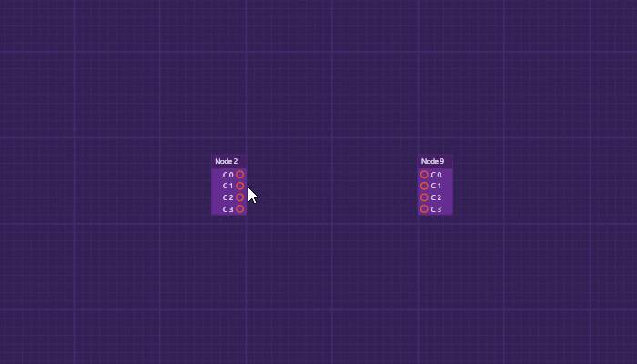

<!--
import Image from '@theme/IdealImage';

<Image img={require('./assets/editor-interaction.gif')} /> -->

## What is Nodify?

Nodify is a WPF node-based [editor control](components/editor) featuring a collection of useful components like [nodes](components/nodes), [connections](components/connections) and [connectors](components/connectors) aiming to simplify the process of building node based tools.

It is mainly inspired by Unreal Engine's [Blueprints Visual Scripting](https://docs.unrealengine.com/en-US/ProgrammingAndScripting/Blueprints/index.html) system, but focusing only on the user interface and user interaction part.

Unlike other node-based editors, Nodify can be embedded in any WPF application.

## What to expect

Nodify itself is not an application, nor does it provide any business logic. It offers an editor component that you can embed in your own application, enabling you to focus on the business logic.

Nodify provides the UI logic like having an infinite area where you can place and move nodes around, select and drag groups of nodes, connect and disconnect nodes or connectors, zoom, automatically move the screen when dragging a node or a wire near the edge and much more.

You will have to write your own viewmodels.

## Why use Nodify?

It was built with love ❤️ and it's free!

Nodify is feature-rich and optimized for interaction with hundreds of nodes at once.

It is built to work with MVVM, meaning you can reuse the viewmodels if you plan to write your own node editor component from scratch.

:::info
Check out the [**example applications**](https://github.com/miroiu/nodify/tree/master/Examples) and their source code.
:::
